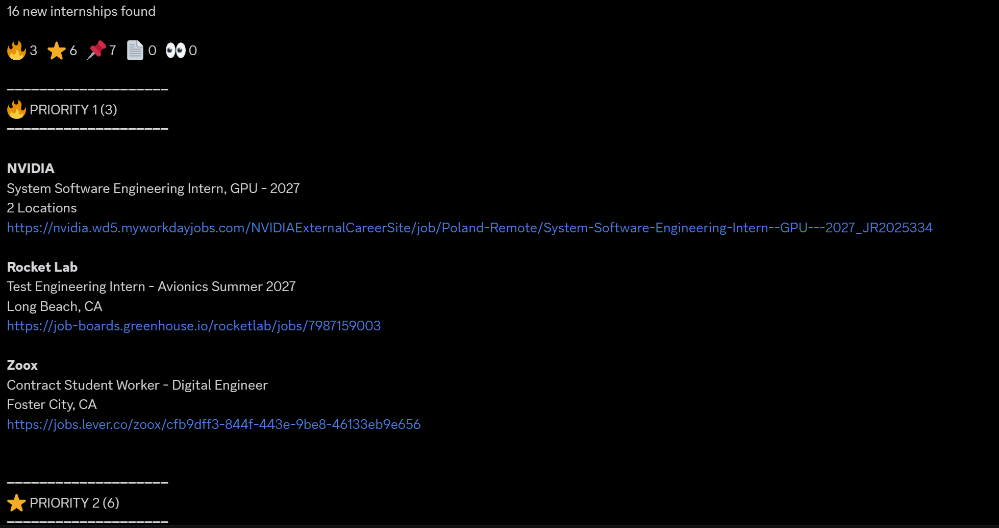

# Internship Tracker

An automated pipeline that checks company career pages daily for new internship postings and sends new matches straight to Discord so I don't have to manually check dozens of company pages every day during recruiting season.

## How it works

1. A scheduled **GitHub Action** runs `main.py` daily.
2. `core/company_loader.py` loads the list of target companies (and which ATS each one uses) from `data/`.
3. For each company, `trackers/tracker_map.py` picks the right tracker class for its ATS (e.g. Greenhouse, Workday, Ashby) and fetches current postings.
4. `core/seen_jobs.py` checks each posting against previously seen job IDs to skip duplicates, and persists the updated state.
5. `core/job_filter.py` filters the remaining new postings using include/exclude keyword lists and an exclude-list for location, so irrelevant roles and unwanted locations don't make it through.
6. `notifications/message_formatter.py` sorts the new postings by the priority assigned to each company in the `data/` company list, and `notifications/discord_notifier.py` sends them to a Discord webhook so that higher-priority companies show up first instead of a flat, unsorted list.
7. Companies with unsupported/custom ATS setups are skipped for now; failed fetches for one company are logged and don't stop the run.

## Project structure

```
internship-tracker/
├── .github/workflows/     # scheduled GitHub Action to run the tracker
├── core/                  # company loading, dedup, filtering
│   ├── company_loader.py
│   ├── seen_jobs.py
│   └── job_filter.py
├── data/
│   ├── companies.csv      # target companies, ATS type, priority
│   └── seen_jobs.json     # dedup state
├── docs/                  
│   └── notification.png   # sample notification shown in the README
├── notifications/         # send Discord notification
│   ├── discord_notifier.py
│   └── message_formatter.py
├── trackers/
│   ├── base_tracker.py    # shared tracker interface
│   ├── tracker_map.py     # maps ATS name -> tracker class
│   └── ...                # one file per ATS (11 total)
├── main.py                # entry point — orchestrates the run
├── .env                   # your Discord webhook (create locally)
└── requirements.txt
```

## Setup

1. Clone the repo and install dependencies:
   ```
   pip install -r requirements.txt
   ```
2. Create a `.env` file with your Discord webhook:
   ```
   DISCORD_WEBHOOK=your_webhook_url_here
   ```
3. Add or edit target companies in `data/companies.csv` (company name, ATS type, and priority).
4. Run the tracker — pick one:
   - **Run locally:** `python main.py`
   - **Run on a schedule via GitHub Actions:** enable the workflow under `.github/workflows/`, then add `DISCORD_WEBHOOK` as a repository secret under Settings → Secrets and variables → Actions.

## Sample notification



Each run posts a summary count, a breakdown by priority tier, and then the postings themselves grouped under priority section headers: company, role, location, and a direct link to the posting.

## Features

- Pulls postings directly from each company's ATS rather than relying on third-party aggregator lists.
- Deduplicates against previously seen jobs so you're never re-notified about the same posting.
- **Sorts notifications by priority**, using a priority value assigned to each company in the CSV company list, grouped into tiers so the companies you care most about show up at the top of the Discord message instead of buried in a long unsorted list.
- **Relevance filtering** via include/exclude keyword lists, so postings that don't match what you're looking for get filtered out before they hit Discord.
- **Location filtering** — excludes postings from specific locations. This is exclude-only rather than include-only: location strings across different companies' postings are formatted too inconsistently to reliably match against an include list, so excluding known-unwanted locations is the more reliable approach.
- Every notification includes a **direct link to the posting**, so you can go straight from Discord to the application.

## Why I built this

Manually checking career pages across dozens of companies every day doesn't scale, and it's easy to miss a posting that only stays up for a few days. This runs unattended, keeps track of what's already been seen, and only surfaces postings that are actually new and relevant, so time goes into applying instead of searching.